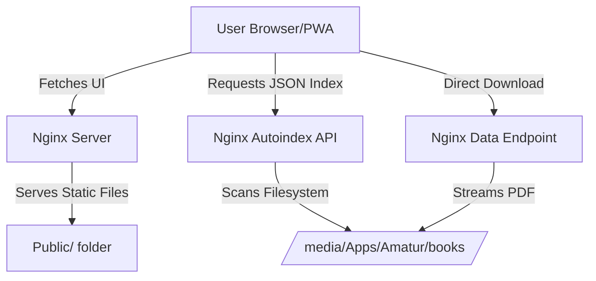
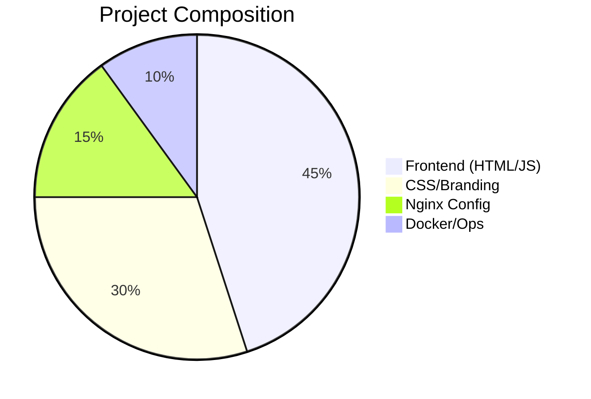
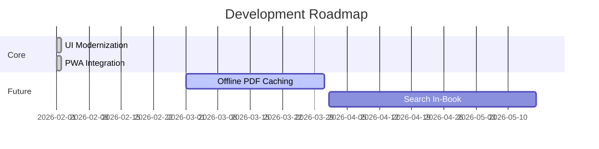

# 📻 9M2PJU Ham Radio Books Library
> A premium, modern, and mobile-native digital library for Amateur Radio enthusiasts.

  

## ✨ Highlights
- **Modern UI**: Sleek glassmorphism design with a responsive grid/list view.
- **Native App Experience**: Fully PWA-compliant with "Install to Home Screen" support.
- **Lightning Fast**: Instant search and smooth transitions.
- **Organized**: Automatic indexing of your Radio archive with beautiful folder navigation.
- **Branded**: Custom branding and high-end typography (Plus Jakarta Sans).

---

## 🛠️ Architecture
The library uses a modern decoupled architecture for maximum stability and performance.

### System Workflow

### Component Breakdown

---

## 🚀 Features Matrix

| Feature | Description | Status |
| :--- | :--- | :---: |
| **Glassmorphism** | Semi-transparent panels with Blur effects | ✅ |
| **PWA Support** | Installable as a native app on iOS/Android | ✅ |
| **Instant Search** | Filter hundreds of books in real-time | ✅ |
| **Breadcrumbs** | Easy navigation in deep folder structures | ✅ |
| **Dark Mode** | Default midnight theme for low-light reading | ✅ |
| **Safe Areas** | Mobile support for notches & safe zones | ✅ |

---

## 👨‍💻 Developed By
**Served to you by 9M2PJU**
Visit us at [hamradio.my](https://hamradio.my)

---

### 📡 Roadmap

---
*73 and Good DX!* 📻📡
